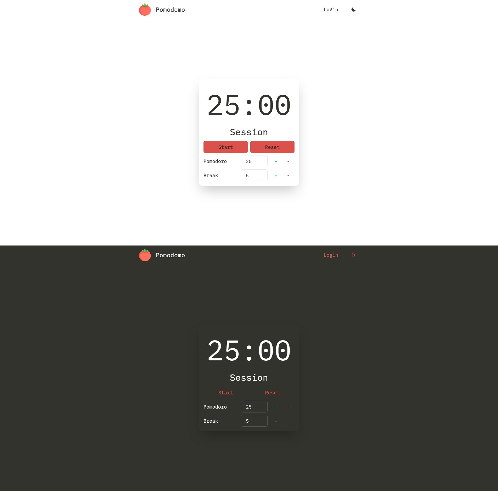
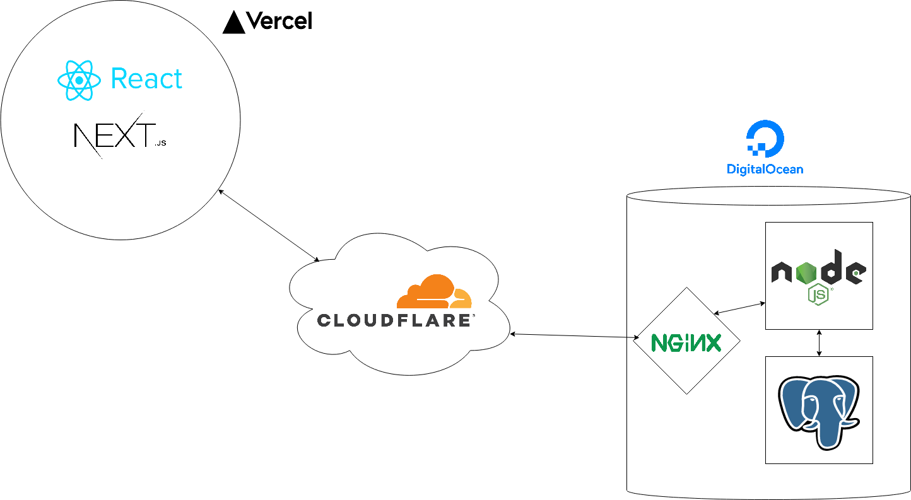

# Pomodomo API

A backend exposing an API for [pomodomo](https://github.com/khoaHyh/pomodomo)



## Known Issues

  * Testing currently doesn't work for PostgreSQL databases yet

## Local development   

#### `Setup`
```shell
$ git clone https://github.com/khoaHyh/pomodomo-api.git

$ cd pomodomo-api

$ npm i
```
#### `Run server`
```shell
$ npm run dev
```
#### `Test`
```shell
$ npm test
```

## Features
  * Endpoints with Unit/Integration testing
      * User registration using unique username and password
      * User login (including session maintenance)
  * Test route for E2E testing
      * Seeding data to local database
       

## Tech/framework used
#### Built with:                                                                 
  * PostgreSQL
  * Express
  * Node.js
  * Mocha
  * Chai
  * Passport.js
  * Digital Ocean Ubuntu Droplet
  * Nginx

## App Architecture



  * Our backend (server + database) is nested inside a Digital Ocean droplet
  * Requests go through Cloudflare, with Authenticated Origin Pulls
      * Authenticated Origin Pulls allow our droplet to validate that a web request is coming from Cloudflare
  * After going through Cloudflare they then go through Nginx, our reverse proxy, which then gets to our server
